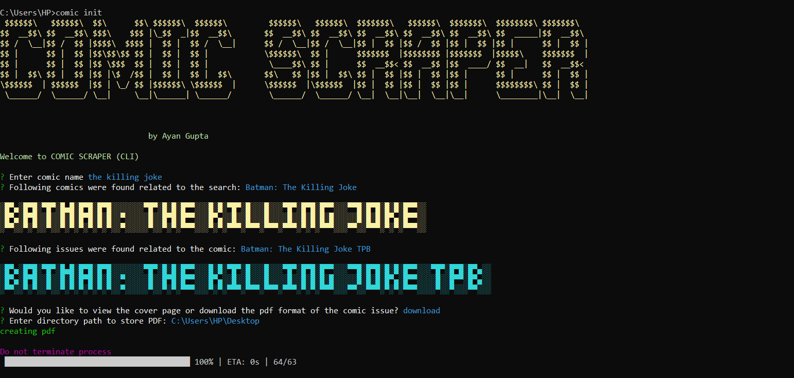

# comic_scraping_project_cli_based

## DISCLAIMER
This project has been developed for **EDUCATIONAL PURPOSE** only i.e to showcase scraping abilities with NODE JS

## DESCRIPTION
The comic scraping project (*cli based*) provides functionality to search comics, scrapes them from [readallcomics.com](http://readallcomics.com) and manifests a PDF file of the same, to be saved on the system.
- The CLI program uses inquirer to select options
- Creative UI (*chalk, figlet, cli-progress*) to enhance user experience

## SCREENSHOT

